# Virgin Atlantic Website Clone ,[Checkout link](https://sunnykumar-code.github.io/virgin-atlantic/)


## Description
This project is a clone of the Virgin Atlantic website, designed using only HTML and CSS. The goal was to replicate the website's structure and design as closely as possible without using JavaScript. The project was developed as a team effort, showcasing different sections built by individual team members.

## Team Work
- **Sunny Kumar** - Project Head, responsible for the creation and design of the **header** section.

### Header Screenshots:

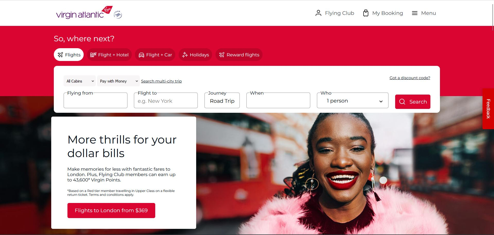
- **Header Section (Part 1):** This screenshot showcases the initial design of the header, including the logo, navigation bar, and main structure. The focus is on clean and professional alignment.

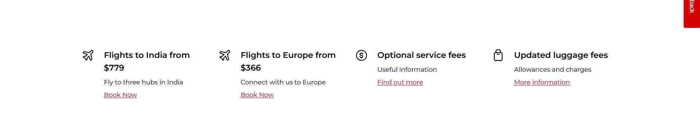
- **Header Section (Part 2):** A continuation of the header design, showing the fully expanded navigation bar with more detailed options, as well as the search functionality.

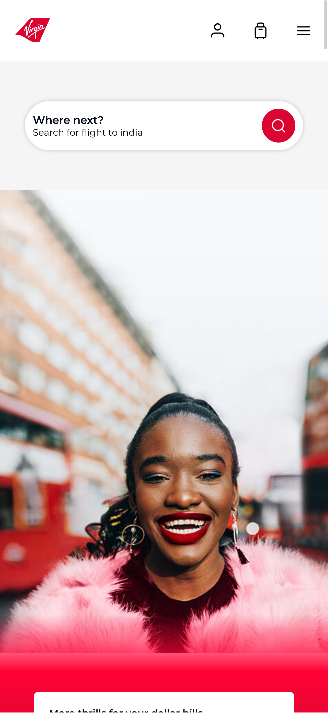
- **Responsive Header:** This image highlights how the header dynamically adapts to different screen sizes, ensuring a seamless experience across devices like tablets and smartphones.


- **Responsive Hero Section:** This screenshot presents the responsiveness of the hero section. It adjusts beautifully when the screen size changes, keeping all elements centered and visible.

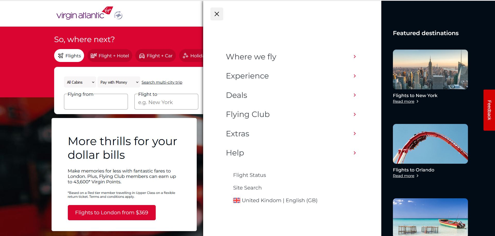
- **Menu Bar with Click Features:** Here, you can see the interaction with the menu bar. Upon clicking the menu, it reveals additional sections and options in a dropdown-like format, creating a smooth user interface.

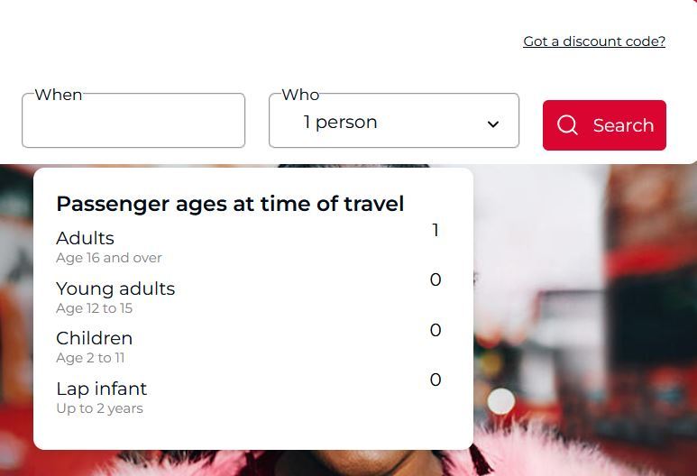
- **Passenger Selection Feature:** This screenshot demonstrates a functional part of the header where users can select the number of passengers through an intuitive section box.

**we have also created custom links for each buttons & anchor tags which take you to the diffrent pages according to their motive or usecases.**


- **Aniket Kumar** - Developed and designed the **middle** section.

### Middle Section Screenshots:

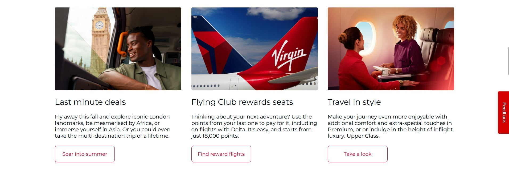
- **Middle Section (Card 1):** This screenshot showcases the first div in the middle section, which contains detailed information about the services or features offered. Each card is styled with modern design elements and includes a clickable button for further interaction.

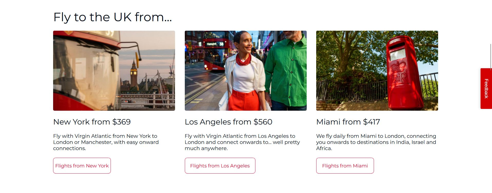
- **Middle Section (Card 2):** This image displays the second div, designed with consistency in layout and functionality. The clickable button allows users to explore more content, making the middle section interactive and user-friendly.

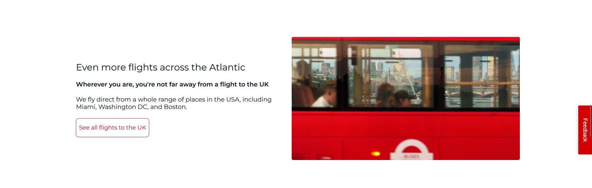
- **Middle Section (Card 3):** The third div follows the same design pattern, ensuring visual harmony throughout the middle section. The purpose of this card is to offer additional services or features, and its button redirects users to more detailed pages.

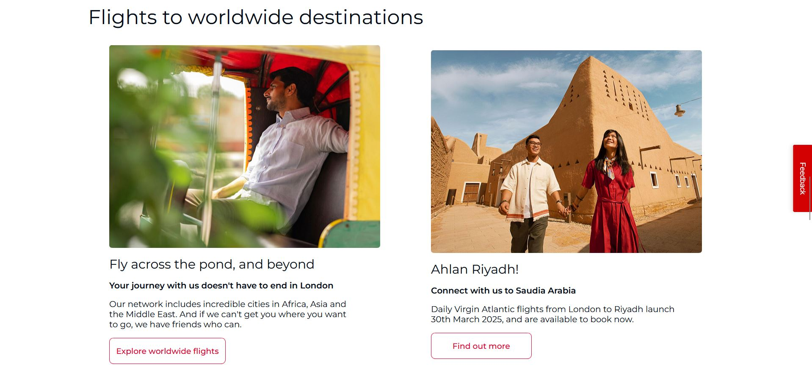
- **Middle Section (Card 4):** This screenshot highlights the last card in the series, offering users a comprehensive range of clickable cards, each serving a unique purpose with a call-to-action button to guide user navigation.

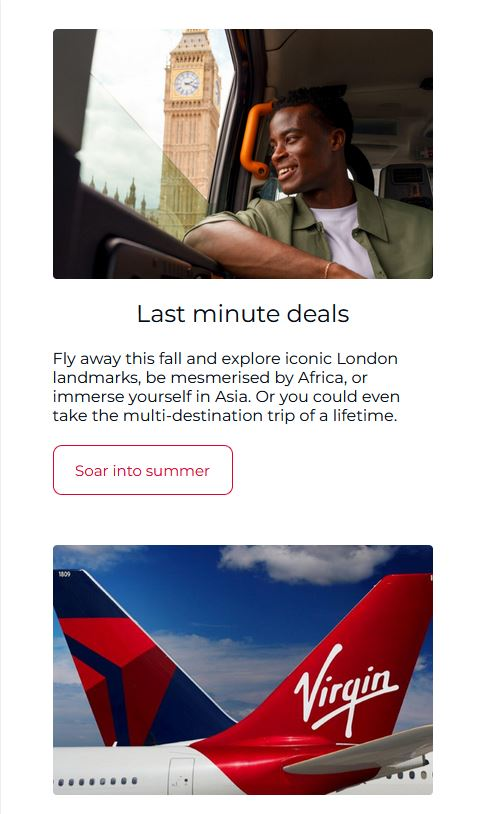
- **Responsive Middle Section:** This image demonstrates how the middle section adapts to different screen sizes, ensuring a seamless user experience across devices. The cards automatically adjust their width and position based on the screen size, maintaining readability and accessibility.

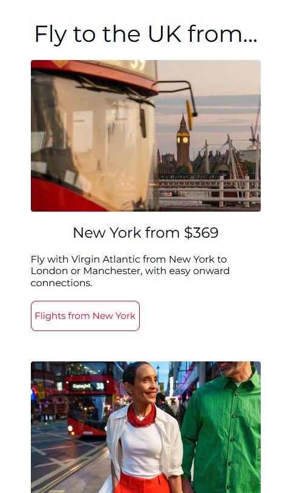
- **Fully Responsive Cards:** This screenshot further emphasizes the responsive design of the middle section. The cards stack and resize gracefully, ensuring that users on smaller screens, such as tablets and mobile devices, have an optimal viewing experience.

### Additional Details:
- All the cards in the middle section are **fully responsive**, designed to adapt to different screen sizes from desktops to mobile devices.
- Each card is created with **specific purposes**, such as offering services, showcasing features, or guiding users to other sections of the website.
- **Clickable buttons** are integrated into each card, allowing users to interact with the content and navigate to more detailed pages or actions.


- **Sachin Chaurasiya** - Created and designed the **footer** section.

### Features and Footer Section Screenshots:

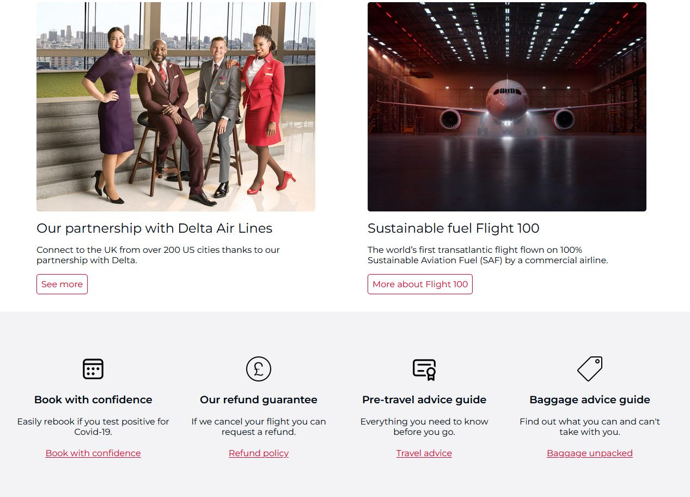
- **Features Section:** This screenshot highlights the section just above the footer, known as the "Features" section. It contains key information or services provided by the website, displayed using a card layout. Each card has clear and concise information, along with clickable buttons to guide users to more detailed content. The design is consistent with the overall theme of the website, ensuring smooth user experience and visual appeal.

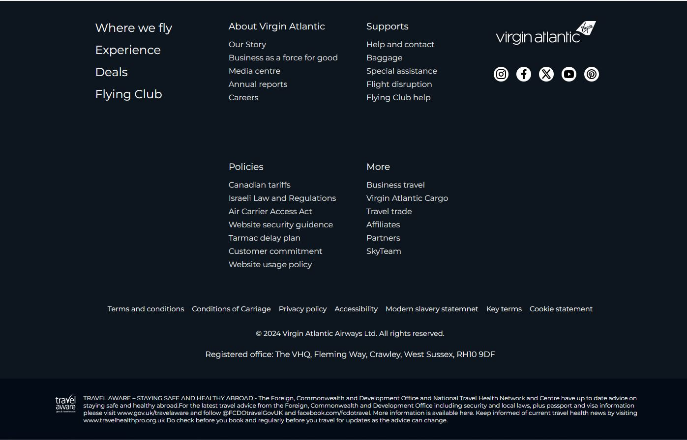
- **Footer Section:** This image showcases the entire footer section, designed to provide users with essential links and contact information. The layout is clean and structured, containing various **anchor tags** that are **active links** and open different pages when clicked. These include links to social media pages, contact details, and important site navigation elements, making it easy for users to access relevant resources.

### Additional Details:
- The **footer section** is fully responsive and adjusts smoothly across various devices and screen sizes, ensuring a consistent user experience.
- Each link in the footer section is an **active link** and opens different pages or external resources, such as social media platforms, company policies, or contact forms, enhancing navigation and connectivity for users.
- The **design of the footer** aligns with the overall branding and theme of the website, providing a professional and cohesive look throughout.
- The cards in the **features section** offer specific information and are designed to be both visually engaging and functional, with clickable buttons that direct users to more detailed pages.


- **Chirag Kapil** - Mentor of this project.

### Mentor's Role:
Chirag Kapil played a pivotal role as the mentor for this project. His guidance and expertise were invaluable throughout the development process. With his deep knowledge in web development, Chirag provided us with clear direction and feedback at every stage, ensuring the project stayed on track and met high-quality standards. 

From helping us troubleshoot technical issues to offering insights on best practices in design and coding, Chirag’s mentorship was instrumental in shaping the project. His emphasis on responsive design, clean code, and user experience pushed the team to deliver a polished product. His dedication and continuous support motivated us to give our best and make this project a success.


## Features
- Replicated Virgin Atlantic's website layout and design.
- Responsive design using HTML and CSS.
- Collaborative team effort to implement different sections of the website.

## Technologies Used
- **HTML** - Markup language for structuring the webpage.
- **CSS** - Styling the components and layout of the webpage.

## Project Head
**Sunny Kumar** 
[Github link](https://github.com/SunnyKumar-code)


## Team Member
**Sunny Kumar** 
[Github link](https://github.com/SunnyKumar-code)

**Aniket Kumar**
[Github link](https://github.com/shinigl)

**Sachin Chaurasiya**
[Github link](https://github.com/chaurasiya-sachin)


## Installation
1. Clone the repository:
   ```bash
   git clone https://github.com/SunnyKumar-code/virgin-atlantic.git

   **To Clone this repo checkout the above github link**
